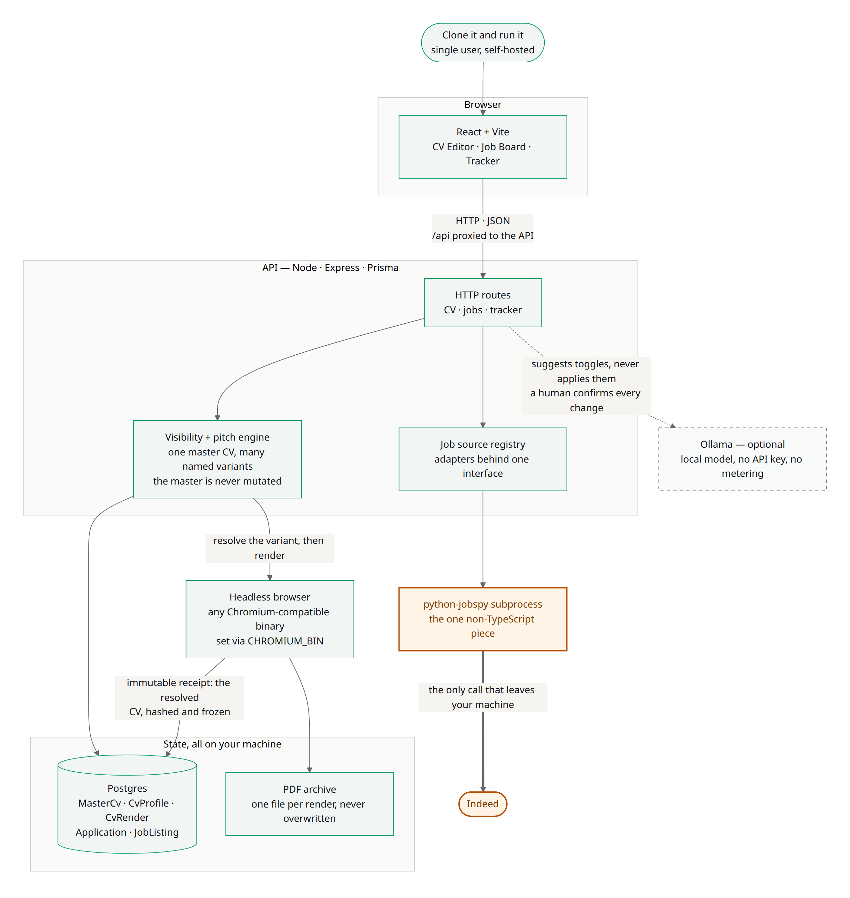
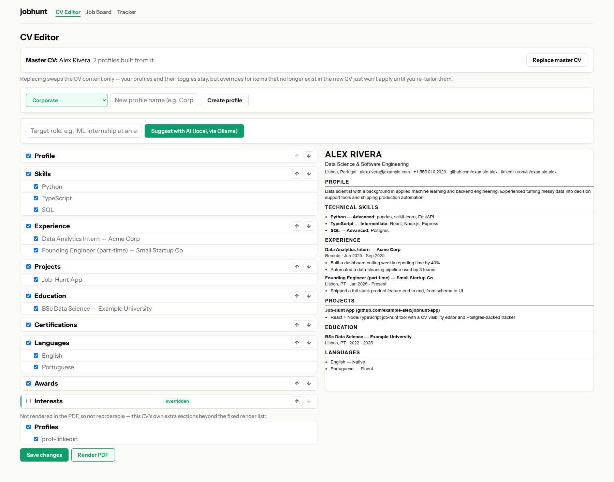
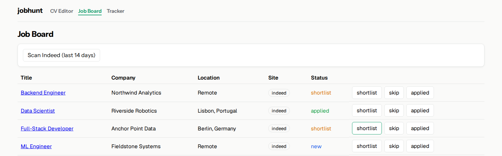
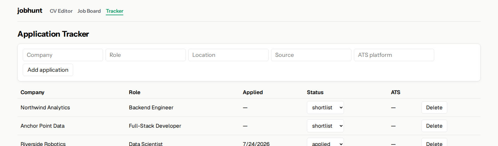

# jobhunt-app

A self-hosted job-hunt tool: one master CV that projects into multiple named,
sector-tailored variants without ever being edited by hand per application,
plus a lightweight job board and application tracker built around it.

## The CV visibility engine

Every section and item in the CV JSON (rxresume format) already carries a
`hidden` flag. The engine (`apps/api/src/cv/visibility.ts`) makes that flag
actually work everywhere — the original renderer this was ported from only
respected it for 2 of 11 sections, so anything else you'd "hidden" in the
editor still showed up in the PDF.

On top of that base layer sits a second one: a named **profile** carries its
own `visibility` override map, applied at render time on top of whatever the
master already has, without ever mutating the master. One master CV, many
sector-tailored variants, always in sync with the source of truth.

**Worked example.** The master CV has `sections.interests.hidden = false`
and `sections.certifications.hidden = false` — both visible by default. Two
profiles layer different overrides on top of that same, untouched master:

```jsonc
// profile "Corporate"
{ "section:interests": true }

// profile "Startup"
{ "section:certifications": true }
```

```ts
const corporateCv = applyVisibility(master, corporateProfile.visibility);
const startupCv = applyVisibility(master, startupProfile.visibility);
```

`corporateCv` hides interests and keeps certifications; `startupCv` does the
opposite. `master` itself is unchanged after both calls — no hand-cloning,
no risk of the "CV I actually send" drifting from the CV I edit. Add a third
sector tomorrow and it's one more override map, not one more file to keep in
sync by hand. Override keys come in three shapes: `section:<key>` for a
top-level section, `section:custom:<id>` for a custom section, and
`item:<itemId>` for any single item — item ids are unique across the whole
document, so no section prefix is needed there.

A [table-driven test suite](apps/api/src/cv/visibility.test.ts) covers this
engine specifically: every section type, the full master × override
precedence matrix, section/item independence, the master-immutability
invariant, multi-profile isolation, and malformed input. The HTTP layer has
its own suite alongside it ([cv](apps/api/src/routes/cv.test.ts),
[jobs](apps/api/src/routes/jobs.test.ts),
[tracker](apps/api/src/routes/tracker.test.ts)) covering validation, the job
board ↔ tracker sync branches, and the error paths.

## AI tailoring — suggests, never applies

The tailoring endpoint calls a local model (Ollama, `qwen2.5:7b` by default)
to suggest which sections and items to hide for a given target role. This is
a deliberate constraint, not a current limitation: the model only ever
returns `{ key, suggestedHidden, reason }` for keys it was explicitly handed
from the CV's own toggle list, anything it hallucinates outside that set is
dropped before a human ever sees it, and nothing is applied automatically.
Every suggestion goes through the same manual toggle-and-save path a person
uses — there is no code path from "model responds" to "profile changes."

## Architecture



_Editable source: [`docs/architecture.excalidraw`](docs/architecture.excalidraw)
— open at [excalidraw.com](https://excalidraw.com) (File → Open) or with the
Excalidraw VS Code extension._

**Job sources are an adapter behind a small registry**
(`apps/api/src/jobs/`), not a plugin system — just a `JobSource` interface
(`id`, `displayName`, `search()`) and a lookup that tracks availability per
source, so a registered-but-not-ready source (like `careeros.ts`) answers
with a clear "not available yet" instead of a stack trace or a wall pretending
it doesn't exist. Indeed is the one real implementation, shelling out to
`scripts/indeed_scan.py` (see below).

**Inference is local-first.** Tailoring calls Ollama on localhost, not a
metered API — no per-request cost to iterate on prompts, and the CV data
never leaves the machine for this path.

**One deliberate subprocess boundary.** Indeed search goes through
`scripts/indeed_scan.py`, a Python script using `python-jobspy`, invoked from
the Node API via `execFile`. jobspy has no real TypeScript/Node equivalent
worth reimplementing, so this is the one piece of the app that stays Python;
everything else — the source interface, dedup, persistence — is TypeScript.
The script does no file I/O or persistence of its own, it only prints JSON to
stdout; dedup is the Node side's job, via Postgres's unique constraint on
`jobUrl`.

## Stack

- **API**: Node, TypeScript, Express, Prisma, Postgres.
- **Web**: React, TypeScript, Vite.
- **Adapters**: TypeScript, with one Python subprocess for the Indeed search
  (`python-jobspy`).
- **AI**: Ollama, local, `qwen2.5:7b` by default.

## Local setup

```bash
# 1. Postgres (host port 5433 — 5432 was already taken locally)
docker compose up -d db

# 2. API — copy apps/api/.env.example to apps/api/.env first
cd apps/api
npm install
npm run prisma:migrate
npm run dev          # tsx watch, http://localhost:4000

# 3. Web, in another terminal
cd apps/web
npm install
npm run dev           # vite, http://localhost:5173

# 4. Local AI tailoring, in another terminal
ollama serve
ollama pull qwen2.5:7b
```

Run the API test suite with `cd apps/api && npm test` — the visibility engine
plus every HTTP route, exercised over real sockets against a mocked Prisma
client, so no database is needed to run it.

## Status

**Built**: the CV visibility engine and per-profile overrides, sector
profiles with reorderable sections (drives both the editor and the PDF
render order), local AI tailoring (suggest-then-review), the Indeed adapter,
a design system ([`DESIGN.md`](DESIGN.md)), and an application tracker that's
now linked to the job board — shortlisting or applying to a listing
materializes a matching tracker row automatically, without ever clobbering
progress you've already logged there (interview/offer/rejected).

**Not built, on purpose:**
- **LinkedIn adapter** — deferred. LinkedIn is aggressive about rate-limiting
  and blocking automated access to search/scrape; not worth the account risk
  for what this app needs.
- **CareerOS adapter** — registered in the job-source registry as disabled
  (see Architecture, above), not implemented. Their board turns out to be
  Algolia-backed with a public, search-only key — technically fine to query
  directly, but reaching into a company's backend instead of using their own
  UI while actively applying there is a judgment call for a direct
  conversation, not something to decide unilaterally by shipping code.

## Screenshots

**CV Editor** — sector profiles, AI tailoring suggestions, section reordering,
and the override marker (the green left-edge bar + "overridden" tag) showing
exactly which toggles this profile has explicitly set versus what it just
inherits from the master. Screenshots use the fake `example_data/master_cv.json`
fixture, not real CV content.



**Job Board** — Indeed results with per-listing status actions.



**Tracker** — shortlisting or applying on the Job Board materializes (or
updates) a matching row here automatically; manual entries work the same as
before.


